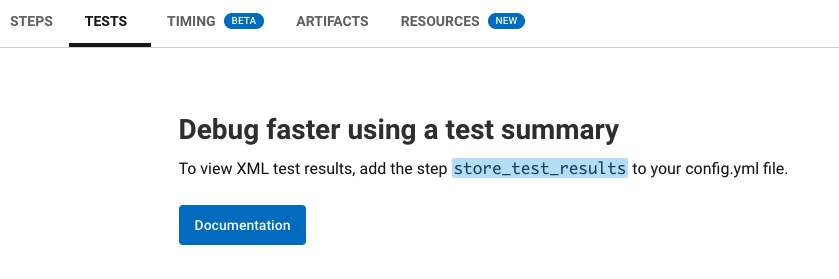

# CSM Hands on Activity - Parallelism and Test Splitting

## How to use this README

There are two branches of this activity, the main branch and the answers branch. The main branch will give instructions for viewing config files and questions associated with the file. 

To view answers and possible optimization ideas, switch to the answers branch. 


## Prereqs

- Completion of the CSM training in Circle Up
- Permission to view customer config files and builds

## Parallelism and Test Splitting to ease Developer Pain

**Problem**: The last thing developers want is a long development lifecycle. When developers run a lot of tests, it can bog down their build and increase duration time. The more tests a project runs, the longer it will take a job to complete on a single machine, which extends the development cycle and delays shipping to end users.

**Solution**: Developers can run tests in parallel by splitting them across multiple separate executors to reduce build time. Users can define a parallelism level to specify how many separate executors get spun up for the test job and use either the CircleCI CLI to split test files or environment variables to configure each parallel machine individually. 

### Key Benefits

- Reduce Build Times: Since test jobs tend to increase build time, test splitting is a simple solution that will reduce overall build time and accelerate shipping to users
- Framework flexibility and support: Developers can use any framework to split tests on CircleCI and are not limited to/or excluded by a specific framework. CircleCI provides documentation for each framework to guide and support  any testing splitting journey.

## A Key Difference

- Parallelism: is running the same job (any job, it does not have to be a test job) on different nodes at the same time. Customers use parallelism for test jobs (test splitting) 95% of the time. The other 5% is to check that the programming language is used correctly (“linting”). Although test splitting takes up the majority of the use case for parallelism, the term parallelism is a general term that encompasses other use cases for running one job across multiple executors, like linting. 

- Test splitting: is splitting a one test job across multiple executors. This term exclusively refers to using parallelism for test jobs and no other use cases.

## Identifying Canidates for Parallelism and Test Splitting

The key pain that parallelism and test splitting can solve is slow build times when running lots of tests. The first step to identifying oppurtunities for test splitting is by looking at test jobs and their durations. 

For example, the below test job is running for over 7 minutes. 


In this case, we would want to bring up test splitting as a solution to this long duration on the job. 

### What to look for..

Since parallelism is primarily used for test splitting, we want to identify jobs with long duration that are **testing**. This can look different for each customer, but there are a few keywords to look for, "test" being the most obvious. 


Testing jobs may also be named by their testing framework, for example `jest`. 


Or by the type of testing (unit, end to end, integration, etc.)


### Insights

You can also view customer insights on the Insights page, looking for test jobs that may be running slowly. 


You can also drill down farther if the customer is uploading test results via `store_test_results:` in their config. You can identify if a customer is uploading tests through the UI on a job dashboard. 


### Parallelism and Test Splitting? 

If the tests and their jobs that you've identified are taking longer than a client may like, it's time to suggest parallelism and test splitting. It's easy to identify jobs that are not using test splitting in the CircleCI UI. When viewing the steps of a job, you will see how many parallel runs were used. 


We can see that there was only one "node" at use during this job, so parallelism is not being utilized. If parallelism was being used, it would look something like this: 


## Example

Let's look at a customer example that may be a canidate for test splitting. Navigate to [this](https://app.circleci.com/pipelines/github/artsy/metaphysics/11196/workflows/5245a58d-423f-4c26-8203-323699640c82) customer config file. 

1. What jobs in this workflow are running tests? 

- [ ] yarn/type-check
- [x] test-jest-v1
- [x] test-jest-v2
- [ ] deploy-staging

We can see by opening up this jobs that there is a step with test in the name, as well as opening the step to see specific tests that ran. 

 

Let's now look at a specific job. Open the `test-jest-v2` job. We can see that there is a test step in this job at yarn test:jest:v2. We can see that this job is not currently using parallelism to split tests because there is no breakdown of specific nodes or level of parallelism being shown.

2. Is this customer uploading test results? How can we tell? 

- [ ] Yes, I can see test result data in Insights
- [x] No, there is nothing under the tests tab. 



Should we suggest uploading test results? Absolutely! Uploading test results unlocks testing by timing data (the most efficient way), and test insights. We will cover more on this in a future training, but as a teaser, uploading test results offers the following benefits:

- Predictability
- Oppurtunity to learn from mistakes 
- Mitigate risk
- Flaky test detection
- Etc!

### What now? 

We've seen that this pipeline is not utilizing test splitting. We can then suggest this feature and it's benefits. But what is involved. What would the customer need to do to implement parallelism and test splitting? There are a few considerations to make when implementing parallelism: concurrency limits, Executor/Resource class credit consumption, configuration changes, etc. 

## Considerations

### Config Updates

In order to adopt parallelism and test splitting, the first thing a customer will need to do is update their config file with two additions: 

1. Define the amount of parallelism using the `parallelism` key. 

```yml
version: 2.1
jobs:
  test:
    docker:
      - image: cimg/<language>:<version TAG>
    parallelism: 4
```
2. Use the CircleCI CLI to tell CircleCI where the tests are, and how to split them (by timing, filesize, filename). 

```yml
 command: |
                TEST=$(circleci tests glob **/__tests__/*.js | circleci tests split --split-by=timings)
                yarn test $TEST
 ```
 
 ### Concurrency Limits
 
 Running jobs in parallel does count towards concurrency limits. The more parallel nodes are specified the higher concurreny count you will have. For example, a parallelism level of 4 will spin up 4 nodes, counting towards concurrency. 
 
 ### Resource Classes
 
 For example, let's say a test job that uses a resource class of Docker/Large and has a parallelism level of 8. This job will spin up 8 Large Docker executors. This will count towards credit usage for the time those containers are running. Customers may want to adjust resources to meet needs and monotor credit usage. 
 
  
 
 ## Additional Resources
 
 ### Case Studies
 
 [Amio](https://circleci.com/blog/how-to-boost-build-time-with-test-parallelism/) reduced testing times by 40%
 [Zygo](https://medium.com/sumone-technical-blog/parallel-tests-on-circleci-5236b8336031) testing decreased by 70%
 
 


